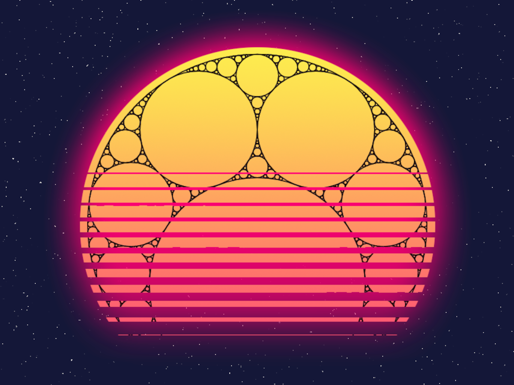

# CARMA-MATRIX Mathematical Art 2023

 

Second place award-winning entry for the CARMA-MATRIX mathematical art 2023 competition [[1, 2](#references)].

The entry was computer-aided art, but not generative AI art. It is available here in various file formats and sizes. Digital display and physical printing are both supported.

---

<figure style="width:500px;">
  
  <figcaption>Figure 1. <i>Apollonian Sunset</i> merges a fractal Apollonian gasket with a synthwave-styled sunset.</figcaption>
</figure>

---

## Table of Contents

- [Key Files](#key-files)
- [Getting Started](#getting-started)
- [References](#references)

## Key Files

| File                         | Notes                                          |
| :--------------------------- | :--------------------------------------------- |
| `apollonian-sunset-print-a3` | For physical printing. A3, 297 &times; 420 mm. |
| `apollonian-sunset-print-a4` | For physical printing. A4, 210 &times; 297 mm. |
| `apollonian-sunset-print-a5` | For physical printing. A5, 148 &times; 210 mm. |
| `apollonian-sunset-print-a6` | For physical printing. A6, 105 &times; 148 mm. |
| `apollonian-sunset-web`      | For digital display.                           |

## Getting Started

Art files are in the directory `assets`.

### Physical Printing

The files intended for physical printing are 300 ppi, 16-bit CMYK colour, PDF files with 3 mm bleed margins and trim marks.

The PDF files are compressed in ZIP format. If your system doesn't natively support ZIP extraction, a ZIP tool will be needed (e.g., 7-Zip, WinRAR, WinZip).

### Digital Display

The file intended for digital display is a 1200 &times; 900 pixel, 300 ppi, 8-bit RGB colour, PNG file.

## References

1. CARMA (n.d.), Gallery: Competition 2023, Computer-Assisted Research Mathematics and its Applications (CARMA), viewed 03 Jul 2026, [CARMA-MATRIX Maths Art/Poster Competition, Gallery 2023](https://carmamaths.org/art/gallery/competition/viewing/?y=2023).

2. FYi Maths (19 Dec 2023), CARMA/MATRIX Poster/Art Competition [Video], viewed 03 Jul 2026, [YouTube](https://www.youtube.com/watch?v=PiuWuKUF134&t=14m52s).
