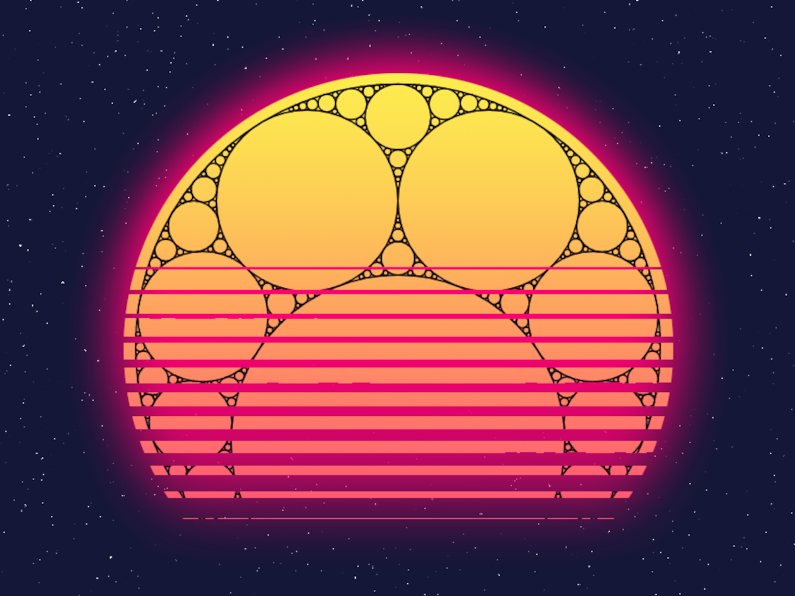

# CARMA-MATRIX Mathematical Art 2023

 

Second place award-winning entry for the CARMA-MATRIX mathematical art 2023
competition [[1](#references)], [[2](#references)], [[3](#references)].
_Apollonian Sunset_ merges a fractal Apollonian gasket with a synthwave sunset
(retrosun). The entry was computer-aided art, but not generative AI art. It is
available here in various file formats and sizes. Digital display and physical
printing are both supported.

---

<figure>
  
  <figcaption>Figure 1. <i>Apollonian Sunset</i> merges a fractal Apollonian gasket with a synthwave sunset (retrosun).</figcaption>
</figure>

---

## Table of Contents

- [Key Files](#key-files)
- [Supplementary Files](#supplementary-files)
- [Getting Started](#getting-started)
- [References](#references)
- [Citation](#citation)
- [License](#license)

## Key Files

| File                         | Notes                                          |
| :--------------------------- | :--------------------------------------------- |
| `apollonian-sunset-print-a3` | For physical printing. A3, 297 &times; 420 mm. |
| `apollonian-sunset-print-a4` | For physical printing. A4, 210 &times; 297 mm. |
| `apollonian-sunset-print-a5` | For physical printing. A5, 148 &times; 210 mm. |
| `apollonian-sunset-print-a6` | For physical printing. A6, 105 &times; 148 mm. |
| `apollonian-sunset-web`      | For digital display. 1200 &times; 900 pixels.  |

Key art files are in the directory `assets`.

## Supplementary Files

| File                                  | Notes                                   |
| :------------------------------------ | :-------------------------------------- |
| `assets/thumbnail-variants-web/*.png` | Thumbnail variants for digital display. |
| `src/apollonian-sunset.html`          | HTML file for digital display.          |

## Getting Started

### Physical Printing

The files intended for physical printing are 300 ppi, 16-bit CMYK colour, PDF
files with 3 mm bleed margins and trim marks.

The PDF files are compressed in ZIP format. If your system doesn't natively
support ZIP extraction, a ZIP tool will be needed (e.g.,
[7-Zip](https://www.7-zip.org), [WinRAR](https://www.win-rar.com),
[WinZip](https://www.winzip.com)).

### Digital Display

The file intended for digital display is a 1200 &times; 900 pixel, 300 ppi,
8-bit RGB colour, PNG file.

An example HTML file displaying _Apollonian Sunset_ is
[available here](src/apollonian-sunset.html).

## References

1. CARMA. "Gallery: Competition 2023". Computer-Assisted Research
   Mathematics and its Applications (CARMA). Accessed: 21 Sep 2026. [Online].
   Available:
   [CARMA-MATRIX Maths Art/Poster Competition, Gallery 2023](https://carmamaths.org/art/gallery/competition/viewing/?y=2023).

2. D. Shearman and A. J. Shaker, "FYiMaths NSW December 2023", _MSOR_, vol. 23,
   no. 1, pp. 38&ndash;44, Sep. 2024, doi:
   [10.21100/msor.v23i1.1505](https://doi.org/10.21100/msor.v23i1.1505).

3. FYi Maths. _CARMA/MATRIX Poster/Art Competition_. (19 Dec 2023). Accessed:
   21 Sep 2026. [Online Video]. Available:
   [youtube.com](https://www.youtube.com/watch?v=PiuWuKUF134&t=14m52s).

## Citation

Citation details are available by clicking **Cite this repository** in the
GitHub sidebar.

## License

This repository is licensed under the Creative Commons Attribution 4.0
International ([CC BY 4.0](https://creativecommons.org/licenses/by/4.0/legalcode.en))
license. The associated [deed](https://creativecommons.org/licenses/by/4.0/deed.en)
highlights key features of the license.

### Attribution

If you use, share or adapt material in this repository, you must provide
[appropriate credit](https://creativecommons.org/licenses/by/4.0/deed.en#ref-appropriate-credit),
a link to the license, and
[indicate if changes were made](https://creativecommons.org/licenses/by/4.0/deed.en#ref-indicate-changes).

<kbd width="10%">
  
</kbd>

Example attribution when displaying one of the repository's art files:\
Figure 2. "Apollonian Sunset" by Travis Stenborg, licensed under
[CC BY 4.0](https://creativecommons.org/licenses/by/4.0/legalcode.en).
Source:
[CARMA-MATRIX Mathematical Art 2023](https://github.com/tstenborg/cm-mathematical-art-2023).

<kbd width="10%">
  
</kbd>

Example attribution when displaying one of the repository's art files, with
minor changes:\
Figure 3. "Apollonian Sunset" by Travis Stenborg, used under
[CC BY 4.0](https://creativecommons.org/licenses/by/4.0/legalcode.en).
Source:
[CARMA-MATRIX Mathematical Art 2023](https://github.com/tstenborg/cm-mathematical-art-2023).
Cropped from the original.

<kbd width="10%">
  
</kbd>

Example attribution when displaying one of the repository's art files, with
major changes by Joe Bloggs:\
Figure 4. This work, "Apollonian Inversion", was adapted from "Apollonian Sunset" by
Travis Stenborg, used under
[CC BY 4.0](https://creativecommons.org/licenses/by/4.0/legalcode.en).
Source:
[CARMA-MATRIX Mathematical Art 2023](https://github.com/tstenborg/cm-mathematical-art-2023).
"Apollonian Inversion" is licensed under
[CC BY 4.0](https://creativecommons.org/licenses/by/4.0/legalcode.en) by
Joe Bloggs.
